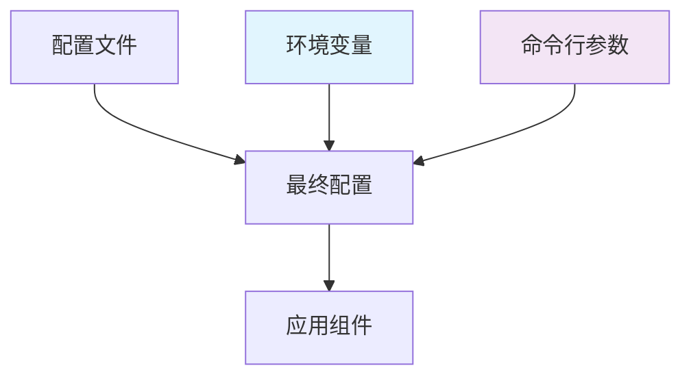

# 配置管理

Go Scaffold 提供了灵活且强大的配置管理系统，支持多种配置源、环境变量覆盖、配置验证和热重载等功能。

## 🔧 配置系统架构

### 配置层次结构



**优先级顺序**（从高到低）：
1. 命令行参数
2. 环境变量
3. 配置文件
4. 默认值

## 📁 配置文件结构

### 主配置文件

`configs/config.yaml` 是主要的配置文件：

```yaml
# 应用基础配置
app:
  name: "go-scaffold"                    # 应用名称
  version: "0.1.2"                       # 应用版本
  mode: "development"                     # 运行模式: development, production, test
  debug: true                            # 调试模式
  timezone: "Asia/Shanghai"              # 时区设置

# HTTP 服务器配置
server:
  host: "0.0.0.0"                       # 监听地址
  port: 8080                             # 监听端口
  read_timeout: "30s"                    # 读取超时
  write_timeout: "30s"                   # 写入超时
  idle_timeout: "60s"                    # 空闲超时
  max_header_bytes: 1048576              # 最大请求头大小 (1MB)
  
  # TLS 配置 (可选)
  tls:
    enabled: false
    cert_file: ""
    key_file: ""

# 数据库配置
database:
  enabled: true                          # 是否启用数据库
  driver: "mysql"                        # 数据库驱动: mysql, postgres, sqlite
  host: "localhost"                      # 数据库主机
  port: 3306                             # 数据库端口
  username: "root"                       # 用户名
  password: "password"                   # 密码
  database: "scaffold"                   # 数据库名
  charset: "utf8mb4"                     # 字符集
  
  # 连接池配置
  max_open_conns: 100                    # 最大打开连接数
  max_idle_conns: 10                     # 最大空闲连接数
  conn_max_lifetime: "1h"                # 连接最大生存时间
  conn_max_idle_time: "30m"              # 连接最大空闲时间
  
  # 日志配置
  log_level: "warn"                      # 数据库日志级别
  slow_threshold: "200ms"                # 慢查询阈值

# Redis 缓存配置
cache:
  enabled: true                          # 是否启用缓存
  host: "localhost"                      # Redis 主机
  port: 6379                             # Redis 端口
  password: ""                           # Redis 密码
  database: 0                            # Redis 数据库编号
  
  # 连接池配置
  pool_size: 10                          # 连接池大小
  min_idle_conns: 5                      # 最小空闲连接数
  max_retries: 3                         # 最大重试次数
  dial_timeout: "5s"                     # 连接超时
  read_timeout: "3s"                     # 读取超时
  write_timeout: "3s"                    # 写入超时
  pool_timeout: "4s"                     # 连接池超时

# JWT 认证配置
jwt:
  secret: "your-secret-key-change-in-production"  # JWT 密钥
  expires_in: "24h"                      # 访问令牌过期时间
  refresh_expires_in: "168h"             # 刷新令牌过期时间 (7天)
  issuer: "go-scaffold"                  # 签发者
  algorithm: "HS256"                     # 签名算法

# 日志配置
logger:
  level: "info"                          # 日志级别: debug, info, warn, error
  format: "json"                         # 日志格式: json, console
  output: "stdout"                       # 输出目标: stdout, file, both
  
  # 文件输出配置
  file:
    path: "logs/app.log"                 # 日志文件路径
    max_size: 100                        # 单个文件最大大小 (MB)
    max_backups: 5                       # 保留的备份文件数量
    max_age: 30                          # 文件保留天数
    compress: true                       # 是否压缩备份文件
  
  # 控制台输出配置
  console:
    color: true                          # 是否启用颜色
    caller: true                         # 是否显示调用者信息

# 国际化配置
i18n:
  default_language: "en-US"              # 默认语言
  languages:                             # 支持的语言列表
    - "en-US"
    - "zh-CN"
  bundle_dir: "configs/locales"          # 语言包目录

# RBAC 权限控制配置
rbac:
  enabled: true                          # 是否启用 RBAC
  model_path: "pkg/rbac/model.conf"      # Casbin 模型文件路径
  auto_save: true                        # 是否自动保存策略
  auto_build_role_links: true            # 是否自动构建角色链接

# 协程池配置
executor:
  enabled: true                          # 是否启用协程池
  pool_size: 100                         # 协程池大小
  max_blocking_tasks: 1000               # 最大阻塞任务数
  nonblocking: false                     # 是否非阻塞模式
  pre_alloc: true                        # 是否预分配协程

# 加密配置
crypto:
  bcrypt_cost: 12                        # bcrypt 加密成本
```

### 环境特定配置

可以为不同环境创建特定的配置文件：

```bash
configs/
├── config.yaml              # 默认配置
├── config.development.yaml  # 开发环境配置
├── config.production.yaml   # 生产环境配置
└── config.test.yaml         # 测试环境配置
```

## 🌍 环境变量

### 环境变量命名规范

环境变量使用 `REI_` 前缀，采用大写字母和下划线：

```bash
# 应用配置
REI_APP_MODE=production
REI_APP_DEBUG=false

# 服务器配置
REI_SERVER_HOST=0.0.0.0
REI_SERVER_PORT=8080

# 数据库配置
REI_DATABASE_HOST=localhost
REI_DATABASE_PORT=3306
REI_DATABASE_USERNAME=root
REI_DATABASE_PASSWORD=password
REI_DATABASE_DATABASE=scaffold

# Redis 配置
REI_CACHE_HOST=localhost
REI_CACHE_PORT=6379
REI_CACHE_PASSWORD=

# JWT 配置
REI_JWT_SECRET=your-secret-key
REI_JWT_EXPIRES_IN=24h

# 日志配置
REI_LOGGER_LEVEL=info
REI_LOGGER_FORMAT=json
```

### .env 文件支持

项目支持 `.env` 文件来管理环境变量：

```bash
# .env
APP_ENV=development
APP_DEBUG=true

DB_HOST=localhost
DB_PORT=3306
DB_USERNAME=root
DB_PASSWORD=password
DB_DATABASE=scaffold

REDIS_HOST=localhost
REDIS_PORT=6379
REDIS_PASSWORD=

JWT_SECRET=your-secret-key-change-in-production

LOG_LEVEL=debug
LOG_FORMAT=console
```

## 🔄 配置热重载

### 启用热重载

```yaml
# configs/config.yaml
app:
  hot_reload: true                       # 启用配置热重载
  reload_interval: "10s"                 # 检查间隔
```

### 支持热重载的配置项

- 日志级别和格式
- 数据库连接池参数
- Redis 连接参数
- JWT 过期时间
- RBAC 策略

### 不支持热重载的配置项

- 服务器监听地址和端口
- 数据库驱动类型
- 基础的应用配置

## 🏗️ 配置结构定义

### 主配置结构

```go
// internal/config/config.go
type Config struct {
    App      AppConfig      `mapstructure:"app"`
    Server   ServerConfig   `mapstructure:"server"`
    Database DatabaseConfig `mapstructure:"database"`
    Cache    CacheConfig    `mapstructure:"cache"`
    JWT      JWTConfig      `mapstructure:"jwt"`
    Logger   LoggerConfig   `mapstructure:"logger"`
    I18n     I18nConfig     `mapstructure:"i18n"`
    RBAC     RBACConfig     `mapstructure:"rbac"`
    Executor ExecutorConfig `mapstructure:"executor"`
    Crypto   CryptoConfig   `mapstructure:"crypto"`
}
```

### 应用配置

```go
// internal/config/app.go
type AppConfig struct {
    Name      string `mapstructure:"name" validate:"required"`
    Version   string `mapstructure:"version" validate:"required"`
    Mode      string `mapstructure:"mode" validate:"oneof=development production test"`
    Debug     bool   `mapstructure:"debug"`
    Timezone  string `mapstructure:"timezone"`
    HotReload bool   `mapstructure:"hot_reload"`
}
```

### 数据库配置

```go
// internal/config/app_database.go
type DatabaseConfig struct {
    Enabled         bool          `mapstructure:"enabled"`
    Driver          string        `mapstructure:"driver" validate:"oneof=mysql postgres sqlite"`
    Host            string        `mapstructure:"host"`
    Port            int           `mapstructure:"port" validate:"min=1,max=65535"`
    Username        string        `mapstructure:"username"`
    Password        string        `mapstructure:"password"`
    Database        string        `mapstructure:"database" validate:"required_if=Enabled true"`
    Charset         string        `mapstructure:"charset"`
    MaxOpenConns    int           `mapstructure:"max_open_conns" validate:"min=1"`
    MaxIdleConns    int           `mapstructure:"max_idle_conns" validate:"min=1"`
    ConnMaxLifetime time.Duration `mapstructure:"conn_max_lifetime"`
    ConnMaxIdleTime time.Duration `mapstructure:"conn_max_idle_time"`
    LogLevel        string        `mapstructure:"log_level" validate:"oneof=silent error warn info"`
    SlowThreshold   time.Duration `mapstructure:"slow_threshold"`
}
```

## 🔧 配置管理器

### 配置管理器接口

```go
// internal/config/manager.go
type Manager interface {
    // 加载配置
    Load(configPath string) (*Config, error)
    
    // 获取当前配置
    GetConfig() *Config
    
    // 重新加载配置
    Reload() error
    
    // 监听配置变化
    Watch(callback func(*Config)) error
    
    // 停止监听
    StopWatch()
    
    // 验证配置
    Validate() error
    
    // 注册日志器
    RegisterLogger(loggerFunc func() logger.Logger)
}
```

### 配置管理器实现

```go
// internal/config/manager.go
type manager struct {
    config     *Config
    configPath string
    viper      *viper.Viper
    watcher    *fsnotify.Watcher
    logger     logger.Logger
    callbacks  []func(*Config)
    mu         sync.RWMutex
}

func NewManager() Manager {
    return &manager{
        viper:     viper.New(),
        callbacks: make([]func(*Config), 0),
    }
}
```

## 🔍 配置验证

### 验证规则

使用 `validator` 包进行配置验证：

```go
// 验证标签示例
type ServerConfig struct {
    Host         string        `mapstructure:"host" validate:"required,ip|fqdn"`
    Port         int           `mapstructure:"port" validate:"required,min=1,max=65535"`
    ReadTimeout  time.Duration `mapstructure:"read_timeout" validate:"min=1s"`
    WriteTimeout time.Duration `mapstructure:"write_timeout" validate:"min=1s"`
}
```

### 自定义验证器

```go
// internal/config/validator.go
func validateConfig(config *Config) error {
    validate := validator.New()
    
    // 注册自定义验证器
    validate.RegisterValidation("database_driver", validateDatabaseDriver)
    validate.RegisterValidation("log_level", validateLogLevel)
    
    return validate.Struct(config)
}

func validateDatabaseDriver(fl validator.FieldLevel) bool {
    driver := fl.Field().String()
    return driver == "mysql" || driver == "postgres" || driver == "sqlite"
}
```

## 🛠️ 使用示例

### 基本使用

```go
// 加载配置
configManager := config.NewManager()
cfg, err := configManager.Load("configs/config.yaml")
if err != nil {
    log.Fatal("Failed to load config:", err)
}

// 使用配置
server := &http.Server{
    Addr:         fmt.Sprintf("%s:%d", cfg.Server.Host, cfg.Server.Port),
    ReadTimeout:  cfg.Server.ReadTimeout,
    WriteTimeout: cfg.Server.WriteTimeout,
}
```

### 环境变量覆盖

```go
// 设置环境变量前缀
viper.SetEnvPrefix("REI")
viper.AutomaticEnv()

// 绑定环境变量
viper.BindEnv("database.host", "REI_DATABASE_HOST")
viper.BindEnv("database.port", "REI_DATABASE_PORT")
```

### 配置热重载

```go
// 监听配置变化
configManager.Watch(func(newConfig *Config) {
    // 更新日志级别
    if logger, ok := app.Logger.(*zap.Logger); ok {
        logger.SetLevel(newConfig.Logger.Level)
    }
    
    // 更新数据库连接池
    if db := app.DB.GetDB(); db != nil {
        sqlDB, _ := db.DB()
        sqlDB.SetMaxOpenConns(newConfig.Database.MaxOpenConns)
        sqlDB.SetMaxIdleConns(newConfig.Database.MaxIdleConns)
    }
})
```

## 🔐 安全配置

### 敏感信息处理

1. **使用环境变量**存储敏感信息：
```bash
REI_DATABASE_PASSWORD=secret_password
REI_JWT_SECRET=super_secret_key
REI_CACHE_PASSWORD=redis_password
```

2. **配置文件中使用占位符**：
```yaml
database:
  password: "${DATABASE_PASSWORD}"
jwt:
  secret: "${JWT_SECRET}"
```

3. **生产环境配置检查**：
```go
func validateProductionConfig(cfg *Config) error {
    if cfg.App.Mode == "production" {
        if cfg.JWT.Secret == "your-secret-key-change-in-production" {
            return errors.New("JWT secret must be changed in production")
        }
        if cfg.App.Debug {
            return errors.New("debug mode should be disabled in production")
        }
    }
    return nil
}
```

## 📊 配置最佳实践

### 1. 配置分层

```yaml
# 基础配置
defaults: &defaults
  app:
    name: "go-scaffold"
    version: "0.1.2"

# 开发环境
development:
  <<: *defaults
  app:
    mode: "development"
    debug: true

# 生产环境
production:
  <<: *defaults
  app:
    mode: "production"
    debug: false
```

### 2. 配置验证

```go
// 启动时验证配置
func validateStartupConfig(cfg *Config) error {
    // 检查必需的配置项
    if cfg.Database.Enabled && cfg.Database.Database == "" {
        return errors.New("database name is required when database is enabled")
    }
    
    // 检查配置兼容性
    if cfg.Cache.Enabled && cfg.Cache.Host == "" {
        return errors.New("cache host is required when cache is enabled")
    }
    
    return nil
}
```

### 3. 配置文档化

```yaml
# 每个配置项都应该有注释说明
database:
  # 数据库连接的最大打开连接数
  # 建议值: CPU核心数 * 2 到 CPU核心数 * 4
  max_open_conns: 100
  
  # 数据库连接的最大空闲连接数
  # 建议值: max_open_conns 的 10-20%
  max_idle_conns: 10
```

### 4. 环境特定配置

```bash
# 使用不同的配置文件
go run cmd/server/main.go server --config=configs/config.production.yaml

# 或使用环境变量指定
export REI_CONFIG_PATH=configs/config.production.yaml
go run cmd/server/main.go server
```

## 🐛 故障排除

### 常见配置问题

1. **配置文件找不到**
```bash
Error: Config file not found: configs/config.yaml
```
解决：检查文件路径，确保配置文件存在

2. **配置格式错误**
```bash
Error: yaml: line 10: mapping values are not allowed in this context
```
解决：检查 YAML 语法，确保缩进正确

3. **环境变量未生效**
```bash
# 检查环境变量是否设置
env | grep REI_

# 检查环境变量绑定
viper.BindEnv("database.host", "REI_DATABASE_HOST")
```

4. **配置验证失败**
```bash
Error: Config validation failed: Port must be between 1 and 65535
```
解决：检查配置值是否符合验证规则

---

**下一步**: 查看 [数据库操作](./database.md) 了解数据库设计和操作