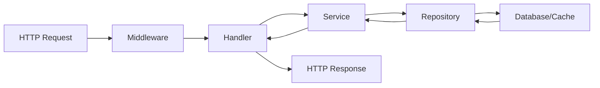
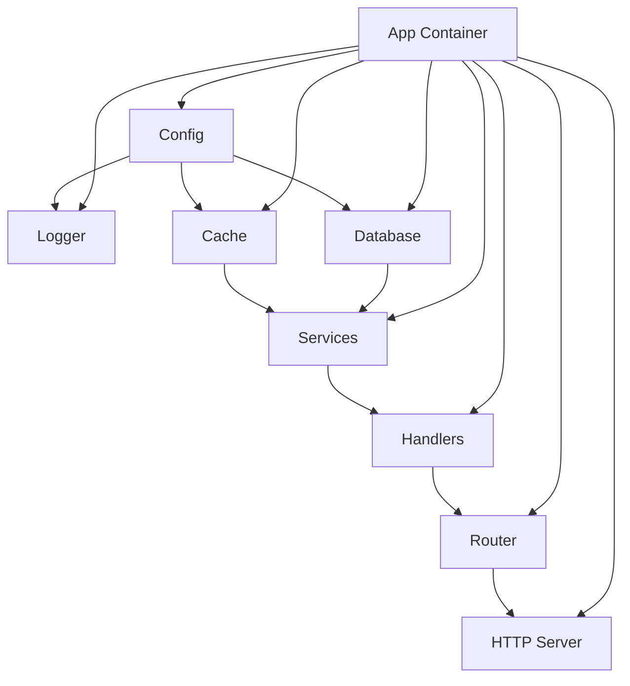

# 项目结构

本文档详细介绍 Go Scaffold 项目的目录结构和代码组织方式，帮助开发者快速理解项目架构。

## 📁 整体目录结构

```
go-scaffold/
├── cmd/                    # 应用程序入口点
│   └── server/            # 服务器应用
├── configs/               # 配置文件
├── docs/                  # 项目文档
├── internal/              # 内部包（不对外暴露）
│   ├── app/              # 应用容器和生命周期管理
│   ├── config/           # 配置管理
│   ├── handler/          # HTTP 处理器
│   ├── middleware/       # 中间件
│   ├── models/           # 数据模型
│   ├── repository/       # 数据访问层
│   ├── router/           # 路由配置
│   └── service/          # 业务逻辑层
├── pkg/                   # 公共包（可对外暴露）
│   ├── cache/            # 缓存抽象
│   ├── cli/              # 命令行工具
│   ├── crypto/           # 加密工具
│   ├── database/         # 数据库抽象
│   ├── dbtx/             # 数据库事务管理
│   ├── executor/         # 协程池管理
│   ├── httpserver/       # HTTP 服务器
│   ├── i18n/             # 国际化
│   ├── jwt/              # JWT 认证
│   ├── logger/           # 日志系统
│   ├── rbac/             # 权限控制
│   ├── sqlgen/           # SQL 生成器
│   ├── utils/            # 工具函数
│   └── yaml2go/          # YAML 转 Go 结构
├── types/                 # 类型定义
│   ├── constants/        # 常量定义
│   ├── errors/           # 错误定义
│   └── result/           # 响应结果
├── .env.example          # 环境变量示例
├── .gitignore            # Git 忽略文件
├── docker-compose.yml    # Docker Compose 配置
├── Dockerfile            # Docker 镜像构建
├── go.mod                # Go 模块文件
├── go.sum                # 依赖校验文件
├── Makefile              # 构建脚本
└── README.md             # 项目说明
```

## 🎯 设计原则

### 1. 分层架构
- **cmd/**: 应用程序入口，负责启动和命令行参数处理
- **internal/**: 业务逻辑实现，按层次组织
- **pkg/**: 可复用的公共组件，独立于业务逻辑
- **types/**: 共享的类型定义和常量

### 2. 依赖方向
```
cmd → internal → pkg → types
```
- 上层可以依赖下层，下层不能依赖上层
- `pkg` 包应该是业务无关的，可以在其他项目中复用

### 3. 接口驱动
- 每个包都定义清晰的接口
- 实现与接口分离，便于测试和替换

## 📂 详细目录说明

### cmd/ - 应用程序入口

```
cmd/
└── server/
    ├── app.go          # 应用命令定义
    ├── initdb.go       # 数据库初始化命令
    ├── main.go         # 程序入口点
    ├── run.go          # 服务运行逻辑
    └── tests.go        # 测试命令
```

**职责**:
- 定义命令行接口
- 解析命令行参数
- 初始化应用容器
- 处理操作系统信号

**示例**:
```go
// cmd/server/main.go
func main() {
    app := cli.NewApp(constants.AppName)
    app.AddCommand(&AppCommand{})
    app.AddCommand(&InitdbCommand{})
    app.Run(os.Args[1:])
}
```

### internal/ - 内部业务逻辑

#### internal/app/ - 应用容器

```
internal/app/
├── app.go                  # 主应用容器
├── app_business.go         # 业务组件初始化
├── app_cache.go           # 缓存组件初始化
├── app_config.go          # 配置组件初始化
├── app_crypto.go          # 加密组件初始化
├── app_database.go        # 数据库组件初始化
├── app_db_tx.go           # 事务管理初始化
├── app_executor.go        # 协程池初始化
├── app_httpserver.go      # HTTP服务器初始化
├── app_i18n.go            # 国际化初始化
├── app_id_generator.go    # ID生成器初始化
├── app_initdb.go          # 数据库初始化逻辑
├── app_jwt.go             # JWT组件初始化
├── app_logger.go          # 日志组件初始化
├── app_mode.go            # 运行模式管理
├── app_mode_initdb.go     # 初始化模式
├── app_mode_server.go     # 服务器模式
├── app_rbac.go            # 权限控制初始化
├── config_helpers.go      # 配置辅助函数
├── constants.go           # 应用常量
├── debug_config.go        # 调试配置
└── reload.go              # 热重载逻辑
```

**职责**:
- 依赖注入容器实现
- 组件生命周期管理
- 配置热重载
- 优雅启动和关闭

#### internal/config/ - 配置管理

```
internal/config/
├── app_database.go        # 数据库配置
├── app_executor.go        # 协程池配置
├── app_i18n.go           # 国际化配置
├── app_init_db.go        # 数据库初始化配置
├── app_jwt.go            # JWT配置
├── app_logger.go         # 日志配置
├── app_rbac.go           # RBAC配置
├── app_redis.go          # Redis配置
├── app_server.go         # 服务器配置
├── config.go             # 主配置结构
├── constants.go          # 配置常量
├── env.go                # 环境变量处理
├── manager.go            # 配置管理器
├── override_env.go       # 环境变量覆盖
└── override_server.go    # 服务器配置覆盖
```

**职责**:
- 配置文件解析
- 环境变量处理
- 配置验证和默认值
- 配置热重载支持

#### internal/handler/ - HTTP 处理器

```
internal/handler/
├── auth_handler.go        # 认证相关处理器
└── constants.go           # 处理器常量
```

**职责**:
- HTTP 请求处理
- 参数验证和绑定
- 响应格式化
- 错误处理

**示例**:
```go
// internal/handler/auth_handler.go
type AuthHandler struct {
    authService service.AuthService
    logger      logger.Logger
}

func (h *AuthHandler) Login(c *gin.Context) {
    var req LoginRequest
    if err := c.ShouldBindJSON(&req); err != nil {
        c.JSON(400, ErrorResponse(err))
        return
    }
    
    token, err := h.authService.Login(req.Username, req.Password)
    if err != nil {
        c.JSON(401, ErrorResponse(err))
        return
    }
    
    c.JSON(200, SuccessResponse(token))
}
```

#### internal/middleware/ - 中间件

```
internal/middleware/
├── auth.go               # 认证中间件
├── config.go            # 配置中间件
├── constants.go         # 中间件常量
├── i18n.go              # 国际化中间件
├── logger.go            # 日志中间件
├── recovery.go          # 恢复中间件
└── traceid.go           # 追踪ID中间件
```

**职责**:
- 请求预处理
- 认证和授权
- 日志记录
- 错误恢复
- 跨域处理

#### internal/models/ - 数据模型

```
internal/models/
├── constants.go          # 模型常量
├── db_base.go           # 基础模型
└── db_user.go           # 用户模型
```

**职责**:
- 数据库表结构定义
- ORM 模型映射
- 模型验证规则
- 关联关系定义

**示例**:
```go
// internal/models/db_user.go
type User struct {
    BaseModel
    Username string `gorm:"uniqueIndex;not null" json:"username"`
    Email    string `gorm:"uniqueIndex;not null" json:"email"`
    Password string `gorm:"not null" json:"-"`
    Status   int    `gorm:"default:1" json:"status"`
}
```

#### internal/repository/ - 数据访问层

```
internal/repository/
├── auth.go              # 认证仓库接口
├── auth_impl.go         # 认证仓库实现
├── constants.go         # 仓库常量
└── repository.go        # 仓库基础接口
```

**职责**:
- 数据访问抽象
- 数据库操作封装
- 缓存策略实现
- 事务管理

#### internal/service/ - 业务逻辑层

```
internal/service/
├── auth/
│   ├── auth.go          # 认证服务接口
│   ├── auth_crypto.go   # 认证加密逻辑
│   ├── auth_helpers.go  # 认证辅助函数
│   ├── auth_impl.go     # 认证服务实现
│   └── constants.go     # 认证常量
├── base.go              # 服务基类
├── constants.go         # 服务常量
└── interface.go         # 服务接口定义
```

**职责**:
- 业务逻辑实现
- 业务规则验证
- 服务间协调
- 事务边界管理

### pkg/ - 公共包

#### pkg/cache/ - 缓存抽象

```
pkg/cache/
├── cache.go             # 缓存接口定义
├── config.go            # 缓存配置
├── constants.go         # 缓存常量
├── doc.go               # 包文档
├── README.md            # 使用说明
└── redis.go             # Redis 实现
```

**特点**:
- 接口驱动设计
- 支持多种缓存后端
- 连接池管理
- 序列化支持

#### pkg/database/ - 数据库抽象

```
pkg/database/
├── constants.go         # 数据库常量
├── database.go          # 数据库接口
├── factory.go           # 数据库工厂
└── README.md            # 使用说明
```

**特点**:
- 多数据库支持
- 连接池管理
- 健康检查
- 迁移支持

#### pkg/logger/ - 日志系统

```
pkg/logger/
├── constants.go         # 日志常量
├── logger.go            # 日志接口
├── README.md            # 使用说明
├── zap.go               # Zap 实现
└── zap_test.go          # 测试文件
```

**特点**:
- 结构化日志
- 多级别支持
- 高性能实现
- 日志轮转

### types/ - 类型定义

```
types/
├── constants/
│   ├── app.go           # 应用常量
│   ├── cache.go         # 缓存常量
│   └── executor.go      # 执行器常量
├── errors/
│   ├── codes.go         # 错误码定义
│   └── error.go         # 错误类型
├── result/
│   ├── helpers.go       # 结果辅助函数
│   ├── pagination.go   # 分页结果
│   └── result.go        # 统一响应结果
├── interfaces.go        # 公共接口
├── request.go           # 请求类型
└── response.go          # 响应类型
```

**职责**:
- 共享类型定义
- 常量管理
- 错误码规范
- 响应格式统一

## 🔄 数据流向

### 请求处理流程



### 依赖注入流程



## 📋 命名规范

### 包命名
- 使用小写字母
- 简短且有意义
- 避免下划线和驼峰

### 文件命名
- 使用小写字母和下划线
- 按功能分组：`auth_handler.go`, `auth_service.go`
- 测试文件：`auth_test.go`

### 接口命名
- 使用名词或动词+er：`Logger`, `Database`, `Handler`
- 接口文件：`interface.go` 或 `{package}.go`

### 实现命名
- 接口名+Impl：`LoggerImpl`, `DatabaseImpl`
- 或具体实现名：`ZapLogger`, `MySQLDatabase`

## 🧪 测试结构

### 测试文件组织

```
pkg/logger/
├── logger.go            # 接口定义
├── zap.go               # Zap 实现
├── zap_test.go          # 单元测试
└── integration_test.go  # 集成测试
```

### 测试类型
- **单元测试**: 测试单个函数或方法
- **集成测试**: 测试组件间交互
- **端到端测试**: 测试完整的请求流程

## 🔧 扩展指南

### 添加新的业务模块

1. **创建模型**: `internal/models/new_model.go`
2. **定义仓库**: `internal/repository/new_repo.go`
3. **实现服务**: `internal/service/new_service.go`
4. **添加处理器**: `internal/handler/new_handler.go`
5. **注册路由**: `internal/router/routes.go`

### 添加新的公共组件

1. **定义接口**: `pkg/newcomponent/interface.go`
2. **实现组件**: `pkg/newcomponent/impl.go`
3. **添加配置**: `internal/config/newcomponent.go`
4. **集成到容器**: `internal/app/app_newcomponent.go`

## 📚 最佳实践

### 1. 包设计原则
- 单一职责：每个包只负责一个功能领域
- 最小接口：接口应该尽可能小和专注
- 依赖倒置：依赖抽象而不是具体实现

### 2. 错误处理
- 使用自定义错误类型
- 在边界处处理错误
- 记录足够的上下文信息

### 3. 配置管理
- 使用结构化配置
- 支持环境变量覆盖
- 提供合理的默认值

### 4. 日志记录
- 使用结构化日志
- 记录关键业务事件
- 避免敏感信息泄露

---

**下一步**: 查看 [配置管理](./configuration.md) 了解如何配置和定制项目