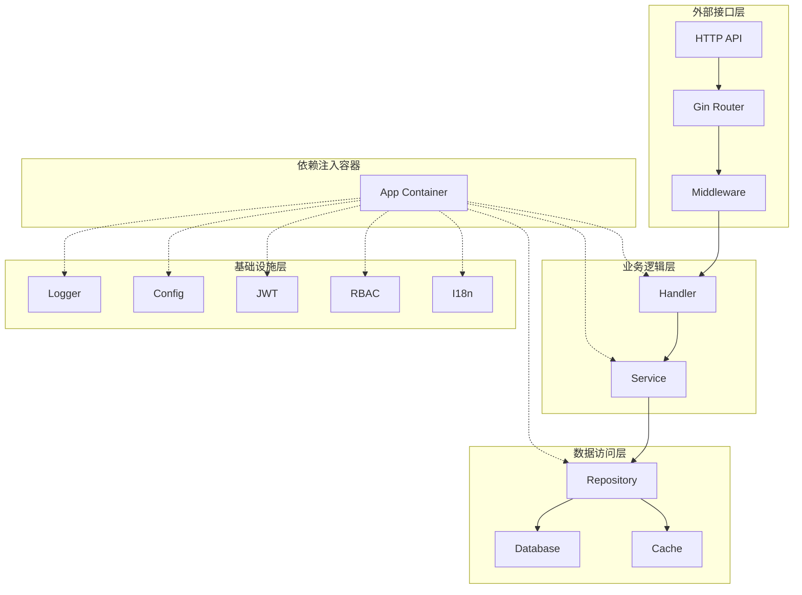
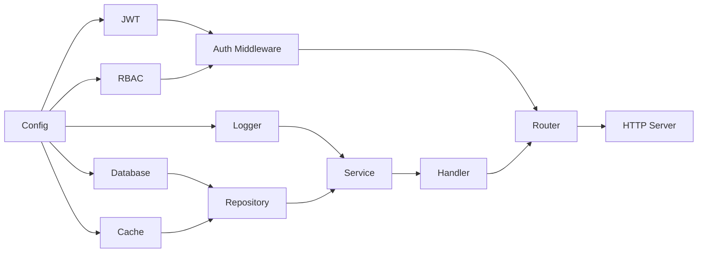
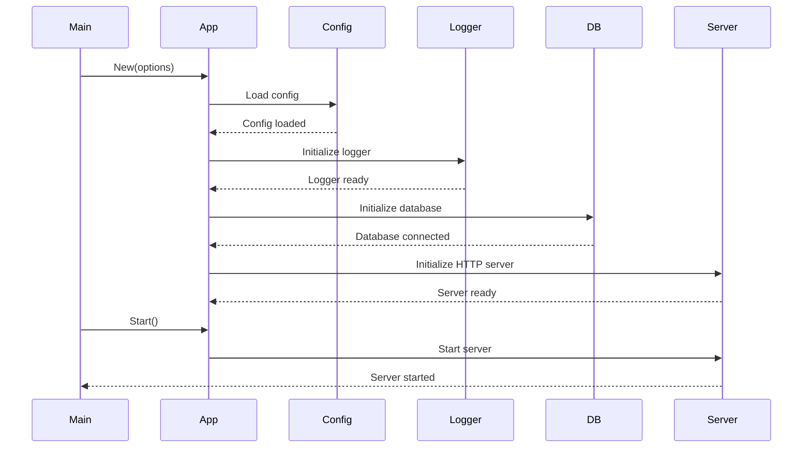
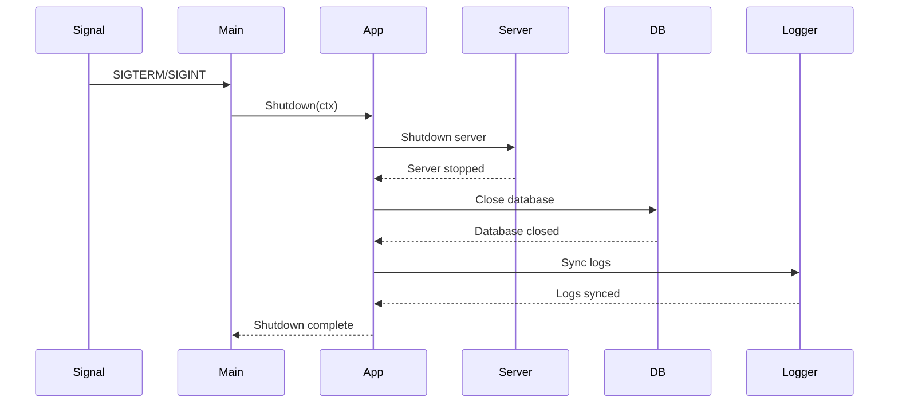
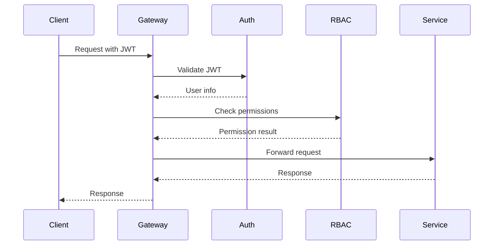

# 架构设计

## 🏗️ 整体架构

Go Scaffold 采用分层架构设计，结合依赖注入容器模式，实现了高内聚、低耦合的系统架构。



## 📁 分层架构详解

### 1. 外部接口层 (Presentation Layer)

**职责**: 处理外部请求，提供 HTTP API 接口

**组件**:
- **Gin Router**: HTTP 路由管理
- **Middleware**: 请求预处理（认证、日志、恢复等）
- **Handler**: 请求处理器，负责参数验证和响应格式化

**特点**:
- 轻量级，只负责 HTTP 协议相关的处理
- 不包含业务逻辑，只做数据转换和验证
- 统一的错误处理和响应格式

### 2. 业务逻辑层 (Business Layer)

**职责**: 实现核心业务逻辑和业务规则

**组件**:
- **Service**: 业务服务，实现具体的业务逻辑
- **Business Rules**: 业务规则和验证逻辑
- **Domain Models**: 领域模型和业务实体

**特点**:
- 独立于外部接口和数据存储
- 可复用的业务逻辑组件
- 清晰的业务边界和职责划分

### 3. 数据访问层 (Data Access Layer)

**职责**: 管理数据持久化和缓存

**组件**:
- **Repository**: 数据访问接口，抽象数据操作
- **Database**: 关系型数据库（MySQL/PostgreSQL/SQLite）
- **Cache**: Redis 缓存
- **Models**: 数据模型和 ORM 映射

**特点**:
- 接口驱动，支持多种数据源
- 统一的数据访问模式
- 事务管理和连接池优化

### 4. 基础设施层 (Infrastructure Layer)

**职责**: 提供通用的基础服务和工具

**组件**:
- **Logger**: 结构化日志服务
- **Config**: 配置管理服务
- **JWT**: 认证令牌服务
- **RBAC**: 权限控制服务
- **I18n**: 国际化服务
- **Crypto**: 加密服务
- **IDGenerator**: ID生成服务

**特点**:
- 横切关注点的统一处理
- 可配置和可扩展的服务
- 高性能和高可用的设计

## 🔄 依赖注入容器

### 容器设计理念

```go
type App struct {
    // 配置管理
    Config        *config.Config
    ConfigManager config.Manager
    
    // 数据存储
    DB     database.Database
    DBTx   dbtx.Manager
    Cache  cache.Cache
    
    // 基础服务
    Logger      logger.Logger
    JWT         jwt.JWT
    RBAC        rbac.RBAC
    Crypto      types.Crypto
    I18n        i18n.I18n
    
    // Web服务
    Router     *gin.Engine
    HTTPServer httpserver.HTTPServer
    
    // 工具服务
    Executor    executor.Manager
    IDGenerator utils.IDGenerator
}
```

### 依赖关系图



### 初始化顺序

1. **配置加载**: 最先加载，为其他组件提供配置信息
2. **日志初始化**: 尽早初始化，记录后续初始化过程
3. **基础服务**: 数据库、缓存、认证等基础服务
4. **业务组件**: 服务层和数据访问层组件
5. **Web组件**: 路由、中间件和HTTP服务器

## 🔌 接口驱动设计

### 核心接口

```go
// 数据库接口
type Database interface {
    GetDB() *gorm.DB
    Close() error
}

// 缓存接口
type Cache interface {
    Get(ctx context.Context, key string) (string, error)
    Set(ctx context.Context, key string, value interface{}, expiration time.Duration) error
    Close() error
}

// 日志接口
type Logger interface {
    Debug(msg string, fields ...interface{})
    Info(msg string, fields ...interface{})
    Error(msg string, fields ...interface{})
    Sync() error
}
```

### 接口优势

1. **可测试性**: 易于创建 Mock 对象进行单元测试
2. **可替换性**: 可以轻松替换具体实现
3. **可扩展性**: 新增实现不影响现有代码
4. **解耦合**: 减少组件间的直接依赖

## 🚀 启动流程

### 应用启动序列



### 关闭流程



## 🔧 配置管理架构

### 配置层次结构

```yaml
# 配置文件结构
app:
  name: "go-scaffold"
  version: "0.1.2"
  mode: "development"

server:
  host: "0.0.0.0"
  port: 8080
  timeout: 30s

database:
  driver: "mysql"
  host: "localhost"
  port: 3306
  name: "scaffold"

cache:
  enabled: true
  host: "localhost"
  port: 6379

logger:
  level: "info"
  format: "json"
  output: "stdout"
```

### 配置热重载

- 监听配置文件变化
- 动态更新可热重载的配置项
- 保证配置更新的原子性和一致性

## 📊 性能优化架构

### 连接池管理

```go
// 数据库连接池配置
type DatabaseConfig struct {
    MaxOpenConns    int           // 最大打开连接数
    MaxIdleConns    int           // 最大空闲连接数
    ConnMaxLifetime time.Duration // 连接最大生存时间
    ConnMaxIdleTime time.Duration // 连接最大空闲时间
}

// Redis连接池配置
type CacheConfig struct {
    PoolSize     int           // 连接池大小
    MinIdleConns int           // 最小空闲连接数
    MaxRetries   int           // 最大重试次数
    DialTimeout  time.Duration // 连接超时时间
}
```

### 协程池优化

```go
// 协程池管理器
type ExecutorManager interface {
    Submit(task func()) error
    SubmitWithTimeout(task func(), timeout time.Duration) error
    Shutdown()
    Running() int
    Free() int
}
```

## 🛡️ 安全架构

### 认证授权流程



### 安全特性

1. **JWT认证**: 无状态的令牌认证
2. **RBAC权限**: 基于角色的访问控制
3. **密码加密**: bcrypt 安全加密
4. **请求验证**: 参数验证和SQL注入防护
5. **HTTPS支持**: TLS/SSL 加密传输

---

**下一步**: 查看 [技术栈](./tech-stack.md) 了解项目使用的技术和框架