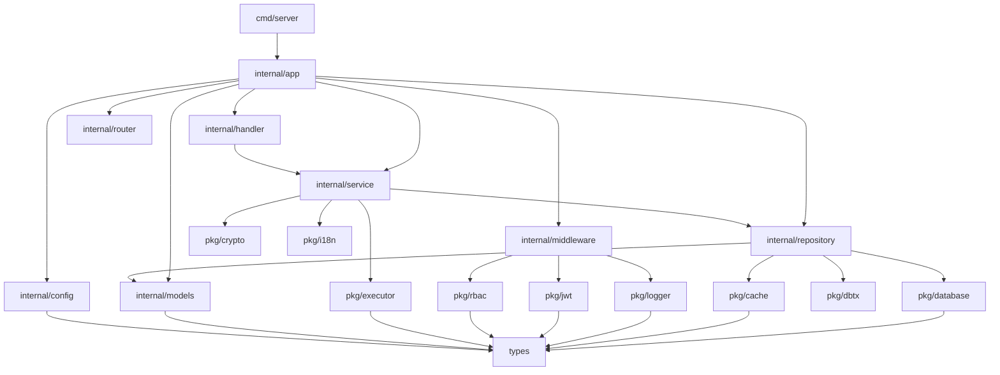

# 模块索引

## 整体结构图

```
┌─────────────────────────────────────────────────────────────┐
│                        cmd/server/                          │
│                    (应用程序入口点)                          │
│  main.go, app.go, initdb.go, run.go, tests.go             │
└────────────────────────┬────────────────────────────────────┘
                         │
                         ↓
┌─────────────────────────────────────────────────────────────┐
│                      internal/app/                          │
│                  (依赖注入容器 - 核心)                       │
│  App 结构体管理所有组件的生命周期和依赖关系                  │
└────────────────────────┬────────────────────────────────────┘
                         │
         ┌───────────────┼───────────────┐
         ↓               ↓               ↓
┌─────────────┐  ┌─────────────┐  ┌─────────────┐
│  Handler    │  │  Service    │  │ Repository  │
│  (HTTP层)   │→ │  (业务层)   │→ │  (数据层)   │
└─────────────┘  └─────────────┘  └─────────────┘
         │               │               │
         └───────────────┼───────────────┘
                         ↓
┌─────────────────────────────────────────────────────────────┐
│                         pkg/                                │
│              (公共组件 - 可复用、业务无关)                   │
│  database, cache, logger, jwt, rbac, executor, etc.        │
└────────────────────────┬────────────────────────────────────┘
                         │
                         ↓
┌─────────────────────────────────────────────────────────────┐
│                        types/                               │
│                  (类型定义 - 最底层)                         │
│  constants, errors, result, interfaces                     │
└─────────────────────────────────────────────────────────────┘
```

## 模块详细索引

### 核心模块

| 模块                  | 职责                     | 类型 | 依赖                          | 技能书路径                |
| --------------------- | ------------------------ | ---- | ----------------------------- | ------------------------- |
| cmd/server            | 应用程序入口             | 核心 | internal/app, pkg/cli         | 01-project-foundation     |
| internal/app          | 依赖注入容器             | 核心 | 所有 internal 和 pkg 模块     | 02-design-specs           |
| internal/config       | 配置管理                 | 核心 | pkg/logger                    | 02-design-specs           |
| internal/handler      | HTTP 请求处理            | 核心 | internal/service              | 11-backend, 12-api        |
| internal/service      | 业务逻辑                 | 核心 | internal/repository           | 11-backend                |
| internal/service/auth | 认证业务逻辑             | 核心 | internal/repository, pkg/jwt, pkg/crypto, pkg/rbac | 11-backend, 12-api        |
| internal/service/rbac | RBAC 业务逻辑            | 核心 | internal/repository, pkg/rbac | 11-backend, 12-api        |
| internal/repository   | 数据访问                 | 核心 | pkg/database, pkg/cache       | 11-backend, 13-database   |
| internal/repository/auth | 认证数据访问          | 核心 | pkg/database                  | 11-backend, 13-database   |
| internal/repository/rbac | RBAC 数据访问         | 核心 | pkg/rbac                      | 11-backend, 13-database   |
| internal/models       | 数据模型                 | 核心 | types                         | 13-database               |
| internal/middleware   | 中间件                   | 核心 | pkg/jwt, pkg/rbac, pkg/logger | 11-backend, 12-api        |
| internal/router       | 路由配置                 | 核心 | internal/handler              | 12-api                    |
| internal/handler/rbac_handler.go | RBAC HTTP 接口   | 核心 | internal/service/rbac         | 11-backend, 12-api        |
| internal/handler/auth_handler.go | 认证 HTTP 接口   | 核心 | internal/service/auth         | 11-backend, 12-api        |

### 支撑模块

| 模块              | 职责                 | 类型 | 依赖                | 技能书路径          |
| ----------------- | -------------------- | ---- | ------------------- | ------------------- |
| pkg/database      | 数据库抽象           | 支撑 | types               | 13-database         |
| pkg/cache         | 缓存抽象             | 支撑 | types               | 11-backend          |
| pkg/logger        | 日志系统             | 支撑 | types               | 11-backend          |
| pkg/jwt           | JWT 认证             | 支撑 | types               | 11-backend, 12-api  |
| pkg/rbac          | 权限控制             | 支撑 | pkg/database, types | 11-backend          |
| pkg/executor      | 协程池管理           | 支撑 | types               | 11-backend          |
| pkg/httpserver    | HTTP 服务器          | 支撑 | types               | 12-api              |
| pkg/dbtx          | 事务管理             | 支撑 | pkg/database, types | 13-database         |
| pkg/crypto        | 加密工具             | 支撑 | types               | 11-backend          |
| pkg/i18n          | 国际化               | 支撑 | types               | 11-backend          |

### 工具模块

| 模块           | 职责                 | 类型 | 依赖  | 技能书路径      |
| -------------- | -------------------- | ---- | ----- | --------------- |
| pkg/cli        | 命令行工具           | 工具 | types | 01-project-foundation |
| pkg/sqlgen     | SQL 生成器           | 工具 | types | 13-database     |
| pkg/yaml2go    | YAML 转 Go 结构      | 工具 | types | 04-reusables    |
| pkg/utils      | 工具函数集合         | 工具 | types | 04-reusables    |

### 类型模块

| 模块                | 职责             | 类型 | 依赖 | 技能书路径      |
| ------------------- | ---------------- | ---- | ---- | --------------- |
| types/constants     | 常量定义         | 基础 | 无   | 04-reusables    |
| types/errors        | 错误定义         | 基础 | 无   | 04-reusables    |
| types/result        | 响应结果         | 基础 | 无   | 12-api          |
| types/interfaces.go | 公共接口         | 基础 | 无   | 02-design-specs |

## 能力分布

### 集中式能力

- **依赖注入**: internal/app（App 结构体）
- **配置管理**: internal/config（Config 结构体）
- **路由管理**: internal/router
- **错误处理**: types/errors

### 分散式能力

- **日志记录**: 每个模块都可以使用 logger
- **缓存操作**: service 和 repository 层
- **事务管理**: repository 层
- **参数验证**: handler 层

### 禁止重复实现

- **ID 生成**: 必须使用 pkg/utils/snowflake.go
- **密码加密**: 必须使用 pkg/crypto
- **JWT 生成**: 必须使用 pkg/jwt
- **权限检查**: 必须使用 pkg/rbac
- **日志输出**: 必须使用 pkg/logger

## 关键流转路径

### 核心业务流

```
HTTP Request
    ↓
Middleware (认证、日志、恢复)
    ↓
Router (路由匹配)
    ↓
Handler (参数验证、响应格式化)
    ↓
Service (业务逻辑、规则验证)
    ↓
Repository (数据访问、缓存)
    ↓
Database/Cache
    ↓
Repository
    ↓
Service
    ↓
Handler
    ↓
HTTP Response
```

### 关键数据流

```
配置文件 (config.yaml)
    ↓
ConfigManager (加载、验证)
    ↓
Config 结构体
    ↓
App 容器 (依赖注入)
    ↓
各个组件 (使用配置)
```

### 生命周期

```
创建:
  main.go → app.New() → 初始化所有组件 → app.Start()

运行:
  HTTP Server 监听请求 → 处理请求 → 返回响应

销毁:
  信号捕获 → app.Shutdown() → 优雅关闭所有组件
```

## 模块依赖图



---

**最后更新**: 2026-01-19
